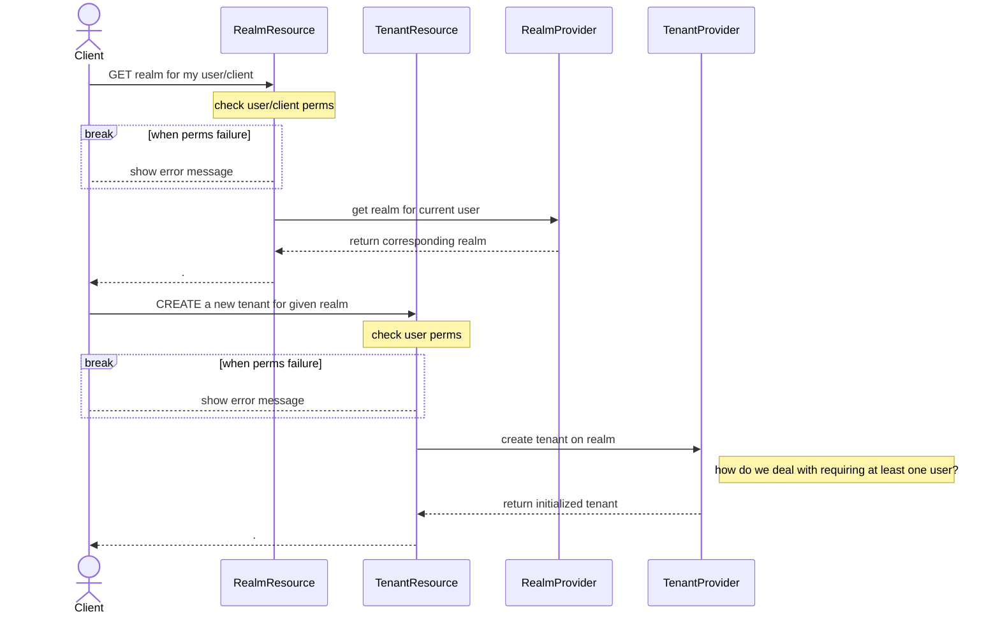
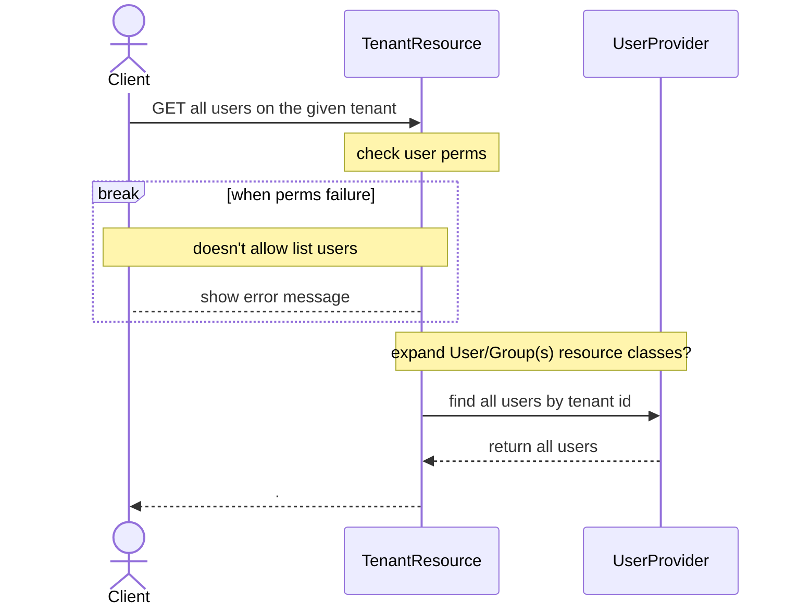

# This document will serve as the main page for keeping track of design goals

## Main Goals

### State Diagram
A top level overview of the expected backend behavior and how a tenant should behave

### User Journey
From the perpsective of a user or a client, how would the code appear to behave and what information would they have access to?

### Entities
| Task                        | Completed          |
|-----------------------------|--------------------|
| [Top Level](./entities.md)  | :white_check_mark: 
| Permissions                 | 
| Identity Mappers            |

### Classes
The classes that we need to either create or modify as made evident by the analysis of the entities and existing keycloak patterns. 

Keycloak follows a pattern:
- a resource object for the outward facing API
- permission objects for managing roles/scopes on model objects
- Model objects for modifying the internal/stored data
- Representation objects for use by the client and API
- Storage objects for implementing various storage protocols
- Entity objects for (de)serialization into the DB
- IdentityMapper objects for user federation

| Class                | New Class?         | Completed         |
|----------------------|--------------------|--------------------
| Tenant Model         | :white_check_mark: |
| Tenant Permissions   | :white_check_mark: |
| Tenant Resource      | :white_check_mark: |
| Tenant Storage       | :white_check_mark: |
| OIDC Claim to Tenant | :white_check_mark: |
| SAML Role to Tenant  | :white_check_mark: |
| User Permissions     |
| User Model           |
| User Storage         |
| Group Model          |
| Group Storage        |
| Group Permissions    |

### Sequence Diagrams

#### Creating a tenant on a realm

#### Finding all users on a tenant
This pattern will work pretty much exactly the same way for **groups** and individual **users** or groups as well.
Can be expanded to [all matching query|paginated|etc]

 

Should also work for **creation** of resources on a tenant:
- new resources can be operated on by a tenant admin or higher
- existing resources 
  - not on the tenant
    - **REALM ADMIN ONLY**
  - on the tenant
    - tenant admin or higher

(These limitations can probably be more flexible with fine grained permissions)

#### Tenant Permissions Interactions

##### Check if user is tenant admin

##### Get all admins for a tenant

##### get tenant specific permissions for a user (fine grained)

#### Mapping an OIDC user to a tenant

#### Mapping a SAML user to a tenant