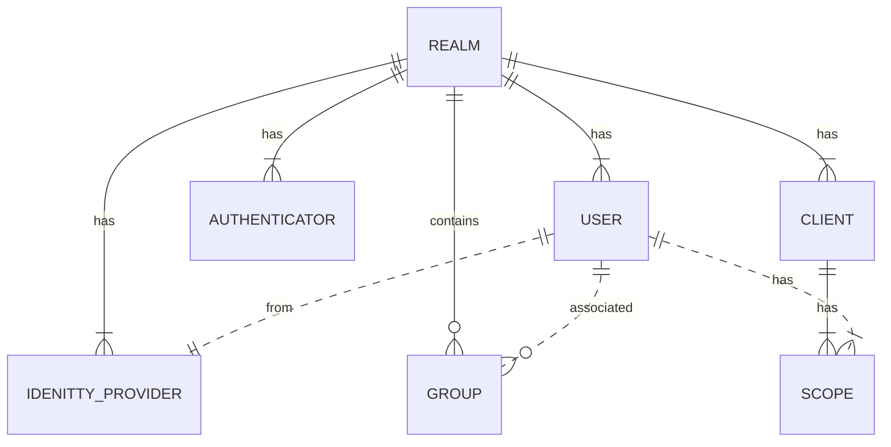
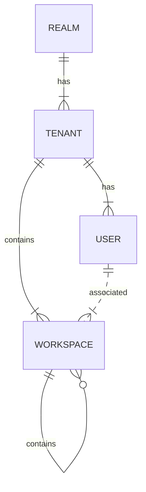

# Entities for Tenancy
## Base entities
- Realm
  - A keycloak [realm](https://www.keycloak.org/docs/latest/server_admin/#configuring-realms)
  - A realm sits at the top of keycloak currently and has control over users, groups, scopes, clients, and all operations pertaining to these things
  - A user can only authenticate and manage within the realm that they belong to
  - There's some conflict with the concept of a tenant here....
  - Realm will contain all of
    - clients
    - scopes
    - identity providers
    - users
    - authentication methods
    - tenants
    - admins
  - The role of the realm is to provide the above list of things to the tenants in a permissioned and organized manner
    - Associating users to tenants
    - allowing a tenant access to an identity provider
    - managing what scopes are accessible to the tenant
    - managing authentication methods and features that are available to the tenant
      - password hashing requirements
      - 2FA
- Tenant
  - This is the conceptual object holding all hierarchal information about a business entity
  - This is the collection of every permission, scope, user, resource server, etc that can be accessed by any user that falls within this domain
  - A tenant should have an associated client (or should this go to the workspace?), base scopes, identity provider, login method, etc
- Workspace
  - The workspace conceptualizes a group of users, permissions, scopes, etc 
  - Similar to how groups could theoretically work in keycloak at the moment
  - Users within a workspace need to be unique
- User
  - A user belongs to a workspace. The root workspace would conceptualize the tenant
  - This relationship allows for tenants to become re-usable spaces for an individual business entity

## The current entity relationship in keycloak

As shown, a realm is currently meant to represent the logical entities for one associated group of users. In many instances this would be all of the users associated with an organization, business, domain, etc. 

Keycloak currently expects that you create a new realm for a newly associated group of users but this creates an interesting set of problems:
- A single domain might manage a bunch of disconnected users that still share commonalities
  - all belong to the same base domain
  - all want access to the same scopes, clients, identity providers, realm admins, resource servers
  - The user can logically belong to some sub-organization within the base organization but this isn't represented in keycloak
    - i.e. being associated with a federated identity provider or LDAP server
  - you have to have multiple authentication endpoints in different realms with different user sets to separate out concerns
  - A user might logically be associated or permissioned in multiple domains but this isn't represented in a single keycloak realm (would require logging into a different realm)

## Some sample user stories that are poorly written but get the point across
One key problem that we want to solve is associating a single user in a large, diverse user pool with its correct authentication and access scopes, identity providers, and business domains without having to duplicate data or create unique endpoints for this purpose. 

User A might belong to a particular tenant but also have permissions to work on certain workspaces underneath a different tenant. Only the tenant that User A belongs to should be able to manage the user itself, however, and we'd like to avoid creating multiple login portals or accounts just to give access to the separate workspace. 

## New Entity Relationship
